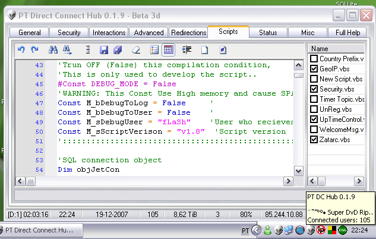



## PT Direct Connect Hub v0\.1\.9

### Description

PTDCH is a complete server-software for the Direct Connect P2P Network.

Use interface advanced by VBScripts or JScript with multiple API Events!

Supports plugins SDK (demos included)!

This new version is more optimizided!

If you liked this work and live in Portugal (Braga), please contact me. I need job :)

**Note: This work how it can you to see, it is a work of a life, and it is not created 100% by me, I used Dll's and class of other authors. And is basead in long work by SDCH and DDCH Team, I worked a long and hard for this project even so, about one year..

Enjoy!
 
### More Info
 

             |
---                |---
**Submitted On**   |2007-12-18 20:19:44
**By**             |[fLaSh \- Carlos\.DF](https://github.com/Planet-Source-Code/PSCIndex/blob/master/ByAuthor/flash-carlos-df.md)
**Level**          |Advanced
**User Rating**    |5.0 (15 globes from 3 users)
**Compatibility**  |VB 6\.0, VB Script, VBA MS Access
**Category**       |[Complete Applications](https://github.com/Planet-Source-Code/PSCIndex/blob/master/ByCategory/complete-applications__1-27.md)
**World**          |[Visual Basic](https://github.com/Planet-Source-Code/PSCIndex/blob/master/ByWorld/visual-basic.md)
**Archive File**   |[PT\_Direct\_20943712192007\.zip](https://github.com/Planet-Source-Code/flash-carlos-df-pt-direct-connect-hub-v0-1-9__1-69775/archive/master.zip)

